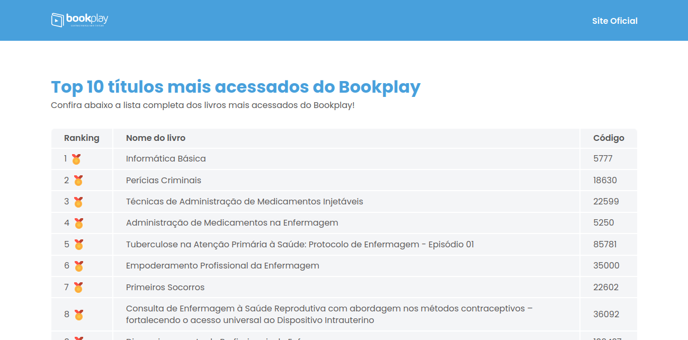

<h1>Projeto - Top 10 títulos mais acessados 📘</h1>

Uma WebPage que mostra os 10 livros mais acessados da BookPlay, consumindo dados de uma API.

<h2> Execução </h2>

 A execução do projeto foi, de forma geral, desafiador e empolgante.
 

 O nível 1 foi a parte em que senti mais liberdade e familiriaridade. Comecei fazendo o projeto com uma estrutura simples de HTML + CSS + JavaScript, porém logo resolvi mudar para React, já que o desafio propôs a utilização do framework. Havia um tempo desde a última vez em que fiz um projeto em React, então tive que estudar os conceitos novamente, de forma resumida. 
 

Iniciei o projeto com Node e Vite. Selecionei o React e limpei alguns dos arquivos que cria automáticamente que não foram necessários. As pastas, resolvi criar: assets, styles, components e data contendo o arquivo .json para importar.

<ol>
   <li>Os assets possuem as imagens que utilizei no projeto.</li>
   <li>Na pasta styles criei três arquivos sendo: index.css, global.css e styles.css. O index possui todos os outros arquivos CSS via @import e a fonte escolhida, para apenas importar um deles na página principal. Essa separação é para facilitar a leitura e a organização dos estilos.</li>
   <li>Na pasta components, criei os componentes que podem ser reutilizados em outras páginas, caso o projeto tivesse.</li>
</ol>

No HTML, fiz uma estrutura simples contendo o header, main (com uma tabela) e footer. Para estilizar, criei variáveis para ter um padrão de fonte e cor, e utilizei a cor solicitada #48a0dc como background do header e do footer.

<h2> Lógica </h2>

No primeiro nível para apresentar os dados do arquivo JSON, importei o arquivo e utilizei a função map do JavaScript para retornar o nome e o código dentro da estrutura de tabela criada, para não ser necessário inserir manualmente.

No segundo nível, pesquisei sobre como fazer a comunicação com uma API em alguns <a href="https://dev.to/antdp425/react-fetch-data-from-api-with-useeffect-27le">blogs</a> e descobri a função useState e useEffect do React. Juntei o resultado com a função map que já estava escrita antes para retornar os dados no mesmo layout. Criei o preloader para mostrar quando está carregando e outro layout para mostrar quando retornar erro.

No terceiro nível, criei um select > options com HTML no header para o usuário selecionar a categoria desejada, mas na hora de fazer a linkagem com as novas url's, não encontrei um jeito que entendesse. Como o desafio é para ver o nível que estou, achei melhor parar até onde consegui do que utilizar ferramentas externas para fazer o trabalho, se não perderia o sentido. De qualquer forma, comentei o que já estava feito, para deixar disponível. 

<h2> Tecnologias utilizadas </h2> 

      

<small>Thank you for reading! ❤️ </small>

